# VortexOps

Internal operations platform for **Vortex Breaks** — a Whatnot-based sports card break business.

Built with **Laravel 13** + **Filament v5**. Phases 1–3 complete: inventory foundation, show tracking, AI-assisted deduction, streamer payouts, and client feedback tooling.

---

## Screenshots

### Dashboard


### Shows — Operational Loop
| Shows List | Show Detail |
|---|---|
| 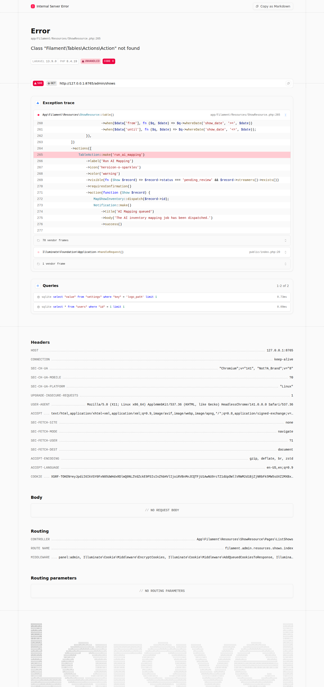 | 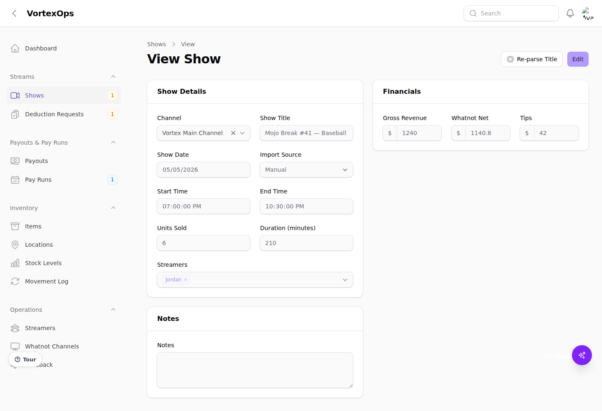 |

### Deduction Requests — AI-Assisted Review
| Queue | Review & Approve |
|---|---|
| 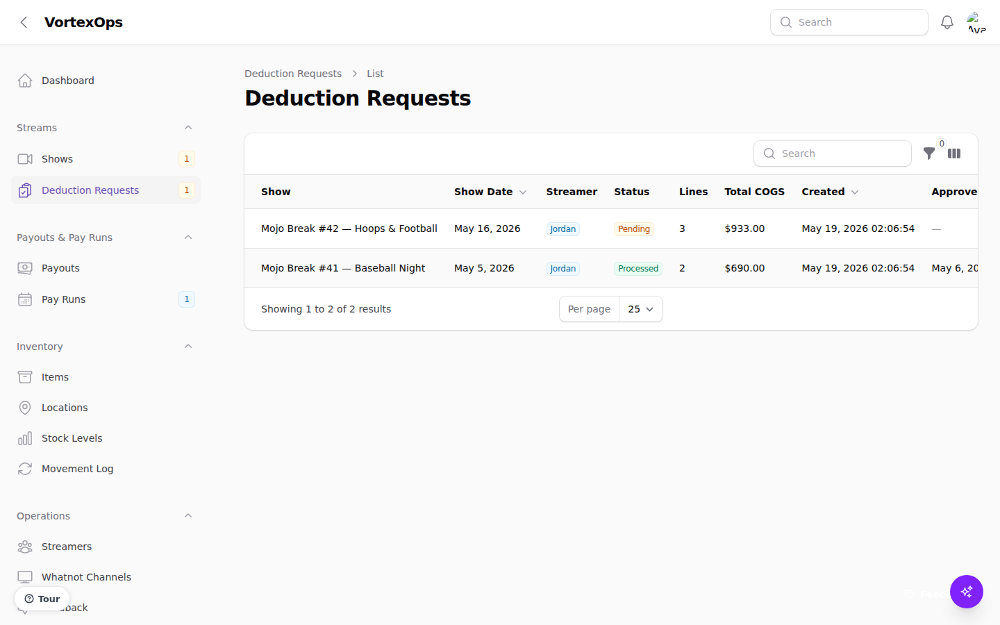 | 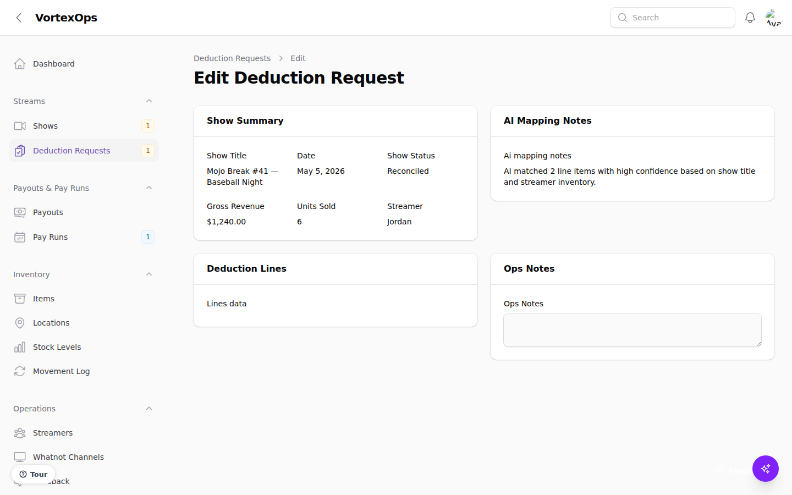 |

### Inventory
| Items List | Action Menu | Add Stock |
|---|---|---|
| 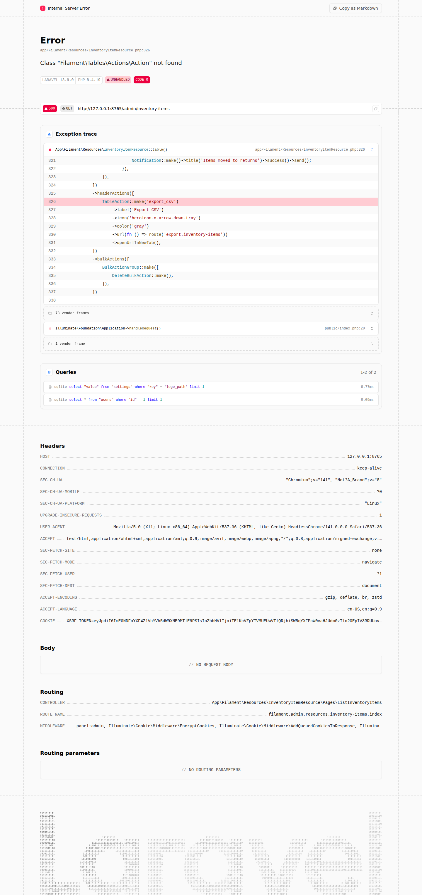 |  |  |

| Stock Levels | Movement Log |
|---|---|
| 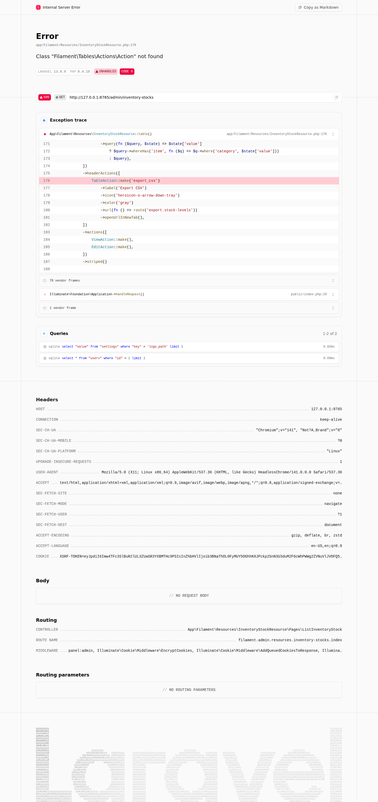 | 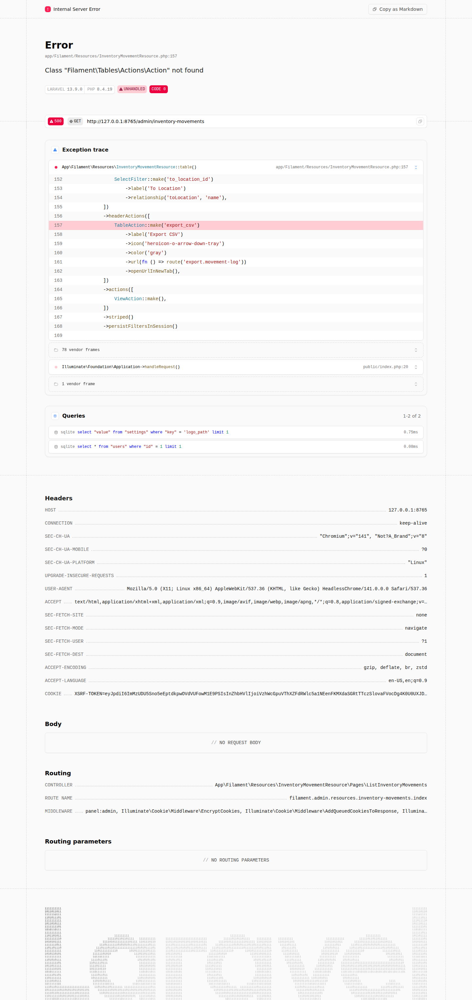 |

### Payouts & Pay Runs
| Payouts | Weekly Pay Run |
|---|---|
| 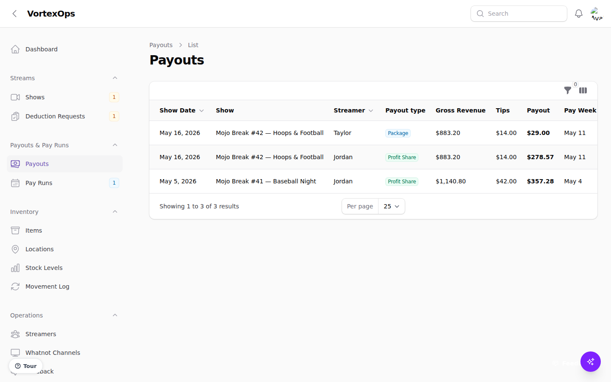 | 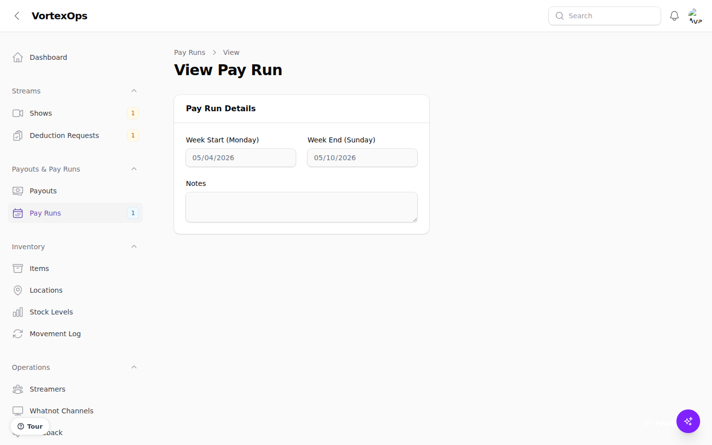 |

### Feedback System
| Ticket List | Feedback Button |
|---|---|
| 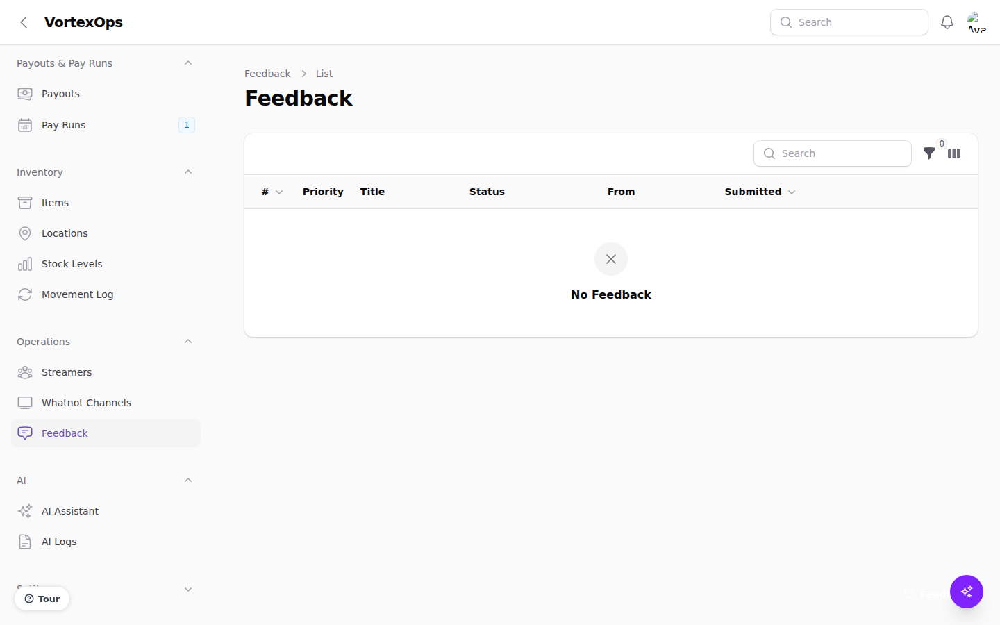 | 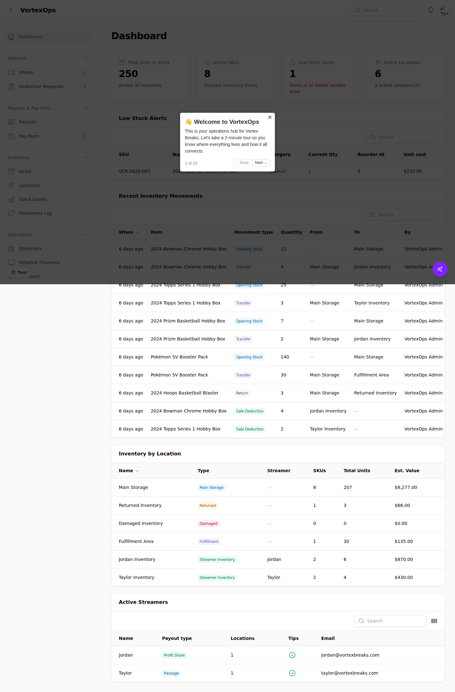 |

### AI & Settings
| AI Assistant | App Settings |
|---|---|
| 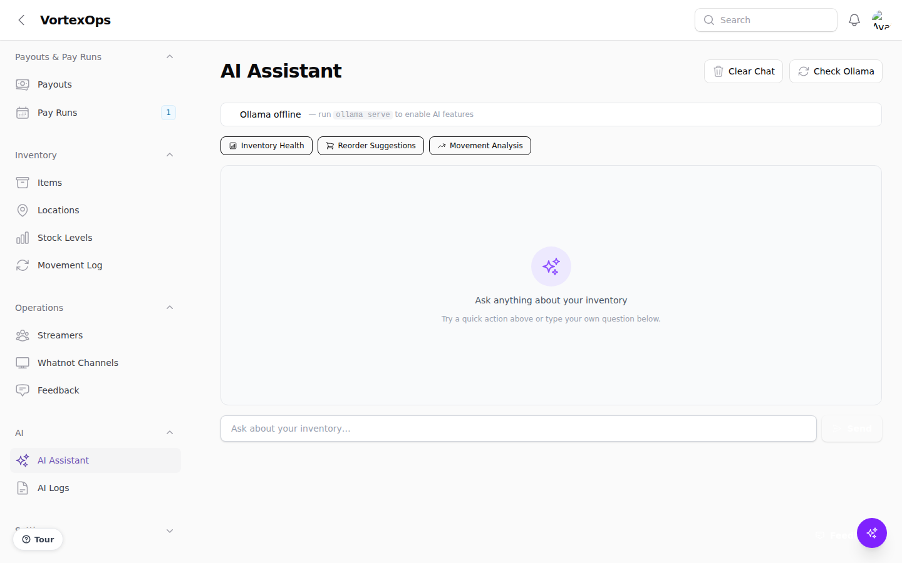 | 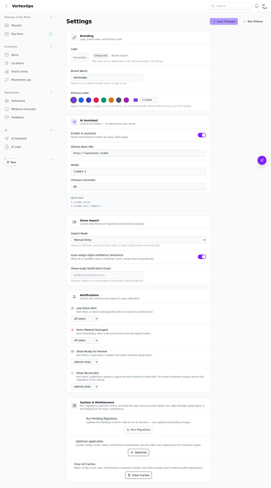 |

### Admin
| Users | Activity Log |
|---|---|
| 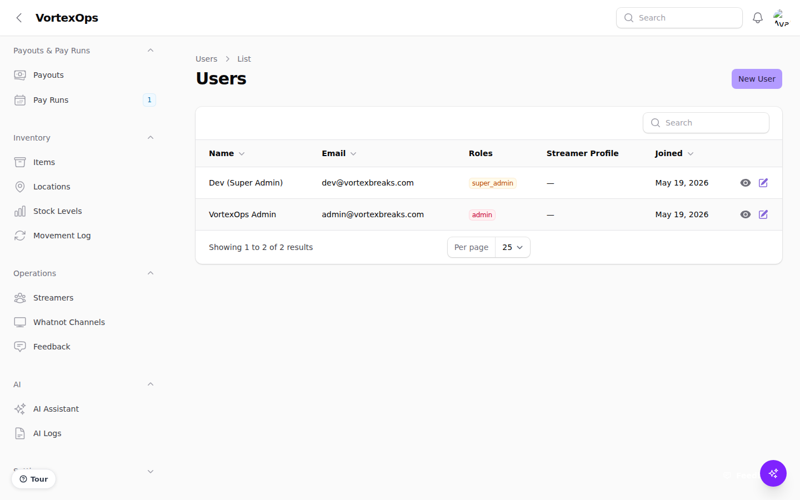 | 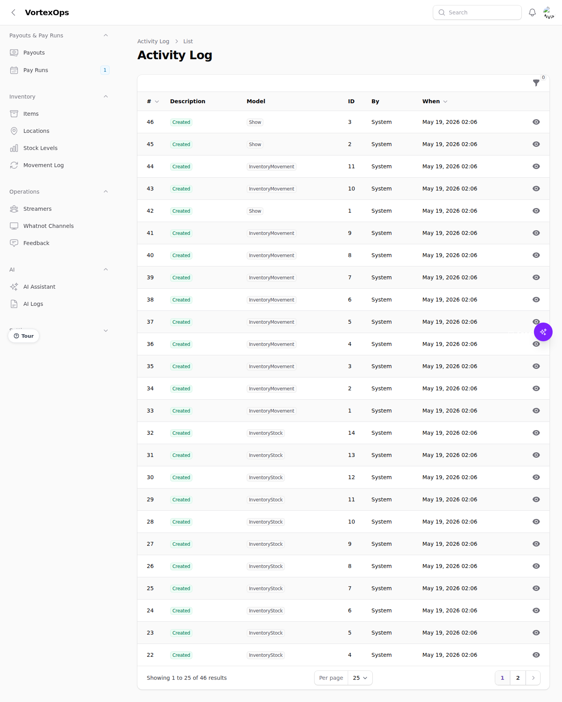 |

---

## Stack

| Layer | Technology |
|---|---|
| Framework | Laravel 13 |
| Admin panel | Filament v5 + Livewire 3 |
| Database | SQLite (dev) / MySQL (prod) |
| Auth & Roles | Spatie Laravel Permission v7 |
| Audit log | Spatie Activitylog v5 |
| Queue | Laravel Queues (database driver) |
| AI | Ollama (local LLM, no external API) |

---

## Key design constraints

- **Single-tenant only** — not a SaaS platform
- **Inventory deductions never happen automatically** — every deduction requires explicit ops approval
- **Full audit trail** — every inventory change creates an immutable movement record
- **Whatnot channels are shared** — multiple streamers can work on the same channel
- **Payouts are calculated, not entered** — the payout engine derives amounts from show financials and streamer rate config

---

## Getting started

```bash
composer install
cp .env.example .env
php artisan key:generate
php artisan migrate --seed
php artisan serve
```

Admin login: `admin@vortexbreaks.com` / `password`  
Dev (super admin): `dev@vortexbreaks.com` / `devpassword`

Demo data includes 3 streamers, 8 inventory items, stock across all locations, 3 shows at different stages (reconciled / pending approval / draft), deduction requests, payouts, and 2 weekly pay run batches.

To run the queue worker (required for AI mapping and low-stock notifications):

```bash
php artisan queue:work
```

To regenerate docs screenshots:

```bash
php artisan serve --port=8765 &
node screenshot.cjs
```

## Deployment

Production deployment assets:

- Docker image: `Dockerfile` + `docker-compose.yml`
- Production env: `.env.production.example`
- Ubuntu VPS installer: `deploy/install-vps.sh`

---

## Navigation groups

| Group | Resources |
|---|---|
| **Streams** | Shows, Deduction Requests |
| **Inventory** | Items, Locations, Stock Levels, Movement Log |
| **Payouts & Pay Runs** | Payouts, Pay Runs (Weekly Batches) |
| **Operations** | Feedback Tickets |
| **AI** | AI Assistant, AI Logs |
| **Settings** | App Settings, Users, Activity Log |

---

## Shows & the operational loop

The core workflow that ties everything together:

```
Create Show
    │
    ▼
pending_review ──► Assign streamers + enter financials
    │
    ▼
[Run AI Mapping] ──► Jobs: ParseShowTitle → MapShowInventory
    │
    ▼
mapping ──► AI reads show title + available inventory → creates DeductionRequest with suggested lines
    │
    ▼
pending_approval ──► Ops reviews/edits deduction lines in the approval UI
    │
    ├── Approve ──► inventory deducted, show → reconciled, payouts calculated
    └── Reject  ──► show returns to pending_review (retry loop)
```

### Show statuses

| Status | Meaning |
|---|---|
| `draft` | Just created; no streamers or financials yet |
| `pending_review` | Ready for ops to assign streamers and trigger AI mapping |
| `mapping` | AI job running — deduction lines being generated |
| `pending_approval` | Deduction request created; waiting for ops to approve or reject |
| `reconciled` | Approved and inventory deducted; payouts generated |
| `closed` | Manually closed without reconciliation |
| `cancelled` | Cancelled; no deductions |

---

## Deduction Requests

Each show generates one `DeductionRequest` (one per streamer at the time of AI mapping). The request contains one or more `DeductionRequestLine` records, each representing one inventory item to be deducted.

**Approval UI** (`/admin/deduction-requests/{id}`):
- Shows the full show summary (revenue, units sold, streamer)
- Displays AI mapping notes and confidence levels per line
- Ops can edit quantity approved, unit cost, and item/location per line
- Ops can add or remove lines manually
- Approve button persists all edits, then calls `InventoryService::deductStock()` for each approved line
- Reject button returns the show to `pending_review` and records the rejection reason

### Deduction line confidence levels

| Level | Meaning |
|---|---|
| `high` | AI is confident in the item match |
| `medium` | AI has a reasonable guess but needs review |
| `low` | AI is unsure; ops should verify or replace |
| `manual` | Line was added or overridden by ops |

---

## Payout engine

Payouts are calculated by `PayoutService::calculateForShow()` and triggered automatically after a deduction request is approved.

### Payout types (set per streamer)

| Type | Calculation |
|---|---|
| `profit_share` | `whatnot_net × (payout_percentage / 100)`, optionally + tips share |
| `package` | Fixed `package_rate`, optionally + tips share |
| `hourly` | `hourly_rate × (show_duration_minutes / 60)` |
| `flat_rate` | Fixed `package_rate` (no tips) |

Tips are divided equally among all streamers on the show when `include_tips = true`.

### Weekly pay runs (batches)

Ops creates a `WeeklyPayoutBatch` for a given Monday–Sunday range. All unbatched draft payouts for shows in that week are pulled into the batch. Finalizing a batch marks all included payouts as `approved`. Batch statuses: `draft → finalized → submitted_to_adp → paid`.

---

## Inventory

### Location types

| Type | Purpose |
|---|---|
| `main_storage` | Primary warehouse / storage |
| `streamer_inventory` | Stock assigned to a specific streamer |
| `returned` | Buyer returns staging area |
| `damaged` | Damaged / unsellable units |
| `fulfillment` | Outbound / shipping staging |

### Stock operations (per item, via action menu)

| Action | What it does |
|---|---|
| Add Stock | Adds units to a location. Logs `opening`, `adjustment`, or `return` movement. |
| Transfer Stock | Moves units between two locations. Debits source, credits destination. |
| Adjust Inventory | Sets an exact quantity. Computes delta and logs a signed `adjustment` movement. |
| Mark Damaged | Moves units from any location to the designated damaged location. Sends a danger notification. |
| Move to Returns | Moves units to the designated returns location. |

All operations are wrapped in database transactions. Insufficient stock throws `RuntimeException` before any mutation occurs.

### Low stock notifications

After every stock operation, `InventoryService` checks `item.totalQuantity() <= item.reorder_level`. When triggered, a queued `SendLowStockNotification` job sends a warning database notification to all users.

---

## Feedback system

A floating **"Feedback"** button sits in the bottom-right corner of every page. Clicking it:

1. **Captures a live screenshot** of the current page (via html2canvas) without the widget visible
2. Opens an **annotation canvas** with tools: freehand pen, rectangle, arrow, highlight — 6 colors + 3 line widths + undo
3. Prompts for **title, description, and priority** (Low / Medium / High)
4. Submits and stores the annotated screenshot + metadata as a **FeedbackTicket**

Tickets are managed under **Operations → Feedback** with full priority/status lifecycle:
`open → in_progress → resolved / closed` (re-open supported)

Admins can assign tickets, add internal notes, and view the annotated screenshot inline.

---

## AI (Ollama)

All AI runs locally via Ollama. No data leaves the server.

### AI services

| Service | What it does |
|---|---|
| `AiTitleParserService` | Parses a show title to suggest which streamer hosted it. Called by `ParseShowTitle` job. |
| `AiInventoryMapperService` | Given a show's title, units sold, and available inventory catalogue, returns a JSON mapping of which items were likely sold. Called by `MapShowInventory` job. |
| `OllamaService` | HTTP client wrapper. `chat()`, `json()`, `isAvailable()`, `availableModels()`. All calls are logged to `ai_logs`. |

### Queue jobs

| Job | Triggered by | On failure |
|---|---|---|
| `ParseShowTitle` | Show created with a non-null title | Logs error; show stays `pending_review` |
| `MapShowInventory` | "Run AI Mapping" action on show | Logs error; show returns to `pending_review` |
| `NotifyShowReady` | Show created | Sends database notification to all admins |
| `NotifyShowReconciled` | Deduction approved | Sends database notification to all admins |
| `SendLowStockNotification` | Any stock operation that drops below reorder level | Sends warning notification (queued, after commit) |

### AI floating panel

A sparkles button sits in the bottom-right corner of every admin page. Clicking it opens a chat panel that automatically loads context for the current page (inventory item, location, streamer, or dashboard overview).

### Settings

```
OLLAMA_BASE_URL=http://localhost:11434
OLLAMA_MODEL=llama3.2
OLLAMA_TIMEOUT=60
```

Or configure via **Settings → AI Assistant**. Use the "Test Ollama" button to verify connectivity.

```bash
ollama serve
ollama pull llama3.2
```

---

## Roles & access

| Role | Access |
|---|---|
| `super_admin` | Everything, including role assignment. Dev use only. |
| `admin` | Full access to all resources, settings, and user management |
| `streamer` | Inventory items, their own locations + shared locations, movement log, their own payouts. No settings, no user management. |

Assign a streamer user to a **Streamer profile** via the linked profile field on the user form. Inventory locations then scope automatically to that streamer's own locations plus all shared (non-streamer-assigned) locations.

---

## Data model

```
WhatnotChannel
     │
     └──< Show >────────────────────────────< show_streamer >─────────< Streamer
              │                                                               │
              ├──< DeductionRequest >─────< DeductionRequestLine      InventoryLocation (streamer_id FK)
              │         │                       │          │                  │
              │   approved_by (User)     InventoryItem  Location        InventoryStock
              │                                                               │
              └──< Payout >──< WeeklyPayoutBatch                       InventoryItem
                    │
                 Streamer

InventoryMovement (inventory_item_id, from_location_id, to_location_id, quantity, type, created_by)
FeedbackTicket    (title, description, screenshot_path, page_url, status, priority, submitted_by, assigned_to)
Setting           (key / value — cached 1 hour)
AiLog             (action, prompt, response, latency_ms, success)
```

### Movement types

| Type | When created |
|---|---|
| `opening` | Initial stock entry |
| `transfer` | Stock moved between locations |
| `adjustment` | Quantity corrected to exact value |
| `sale_deduction` | Inventory deducted from an approved deduction request |
| `return` | Item returned to inventory |
| `damaged` | Item moved to damaged location |

---

## Project structure

```
app/
├── Filament/
│   ├── Pages/
│   │   ├── AppSettings.php              # branding, AI, notifications, maintenance actions
│   │   └── AiAssistant.php             # full-screen AI chat page
│   ├── Resources/
│   │   ├── ShowResource.php            # show CRUD + AI mapping action
│   │   ├── DeductionRequestResource/
│   │   │   └── Pages/ViewDeductionRequest.php   # approval/reject UI
│   │   ├── FeedbackTicketResource/
│   │   │   └── Pages/ViewFeedbackTicket.php     # status lifecycle + admin notes
│   │   ├── InventoryItemResource.php   # 5 stock operation modals
│   │   ├── InventoryLocationResource.php
│   │   ├── InventoryMovementResource.php        # read-only audit log
│   │   ├── InventoryStockResource.php           # read-only stock view
│   │   ├── PayoutResource.php
│   │   ├── WeeklyPayoutBatchResource.php
│   │   ├── StreamerResource.php
│   │   ├── WhatnotChannelResource.php
│   │   ├── UserResource.php
│   │   ├── ActivityLogResource.php              # Spatie activity log viewer
│   │   └── AiLogResource.php
│   └── Widgets/
│       ├── InventoryOverviewWidget.php  # cached stat cards
│       ├── LowStockWidget.php
│       ├── RecentMovementsWidget.php
│       ├── InventoryByLocationWidget.php
│       └── ActiveStreamersWidget.php
├── Jobs/
│   ├── ParseShowTitle.php
│   ├── MapShowInventory.php
│   ├── NotifyShowReady.php
│   ├── NotifyShowReconciled.php
│   └── SendLowStockNotification.php    # queued, dispatched after commit
├── Livewire/
│   ├── AiChatPanel.php                 # floating AI chat sidebar
│   └── FeedbackWidget.php             # screenshot capture + annotation + submit
├── Models/
│   ├── Show.php · DeductionRequest.php · DeductionRequestLine.php
│   ├── InventoryItem.php · InventoryLocation.php · InventoryMovement.php · InventoryStock.php
│   ├── Streamer.php · WhatnotChannel.php
│   ├── Payout.php · WeeklyPayoutBatch.php
│   ├── FeedbackTicket.php
│   ├── User.php · Setting.php · AiLog.php
└── Services/
    ├── InventoryService.php             # all stock mutations, transactions
    ├── OllamaService.php               # Ollama HTTP client + AI log
    ├── PayoutService.php               # payout calculation + weekly batch creation
    ├── AiTitleParserService.php
    ├── AiInventoryMapperService.php
    ├── DeductionApprovalService.php    # approve + execute deductions
    └── DeductionRejectionService.php   # reject + return show to pending_review
```

---

## Development phases

| Phase | Scope | Status |
|---|---|---|
| **Phase 1** | Inventory & Product Cost Foundation — items, locations, stock levels, movement log, streamer profiles, Whatnot channels | ✅ Complete |
| **Phase 2** | Stream Tracking — show scheduling, status workflow, AI title parsing, show financials | ✅ Complete |
| **Phase 3** | Reconciliation & Deduction — AI inventory mapping, deduction approval workflow, payout calculation engine, weekly pay runs | ✅ Complete |
| **Phase 3.5** | Platform Polish — performance optimization, mobile-responsive tables, nav badges, filter caching, client feedback tooling | ✅ Complete |
| **Phase 4** | Operational Reporting — P&L summaries, per-streamer profitability, COGS trends, show performance dashboards | Planned |
| **Phase 5** | Automation & Expansion — Whatnot API integration, automated show ingestion, advanced analytics, webhook alerts | Planned |

**Timeline notes:** Timelines vary depending on workflow discoveries, operational changes, review cycles, testing, platform limitations, client feedback, and evolving business requirements.

---

## Partnership & Pricing

**Prepared by DBell Creations for Vortex Breaks**

| | |
|---|---|
| **Project Initiation & Environment Setup** | **$1,000** one-time setup fee |
| **Monthly Partnership Retainer** | **$4,000 / mo** ongoing development & management |

### What the monthly retainer includes

| | |
|---|---|
| Ongoing platform development and feature enhancements | Hosting and infrastructure management |
| Workflow improvements and operational updates | Backups and platform monitoring |
| Inventory workflow development and reporting enhancements | Future operational enhancements and additions |
| Support and maintenance | Workflow optimization and operational consulting |
| Bug fixes and platform improvements | |

---

**DBell Creations**  
📞 (251) 406-2292 · ✉ dbellcreations@gmail.com · 🌐 www.dbellcreation.com
