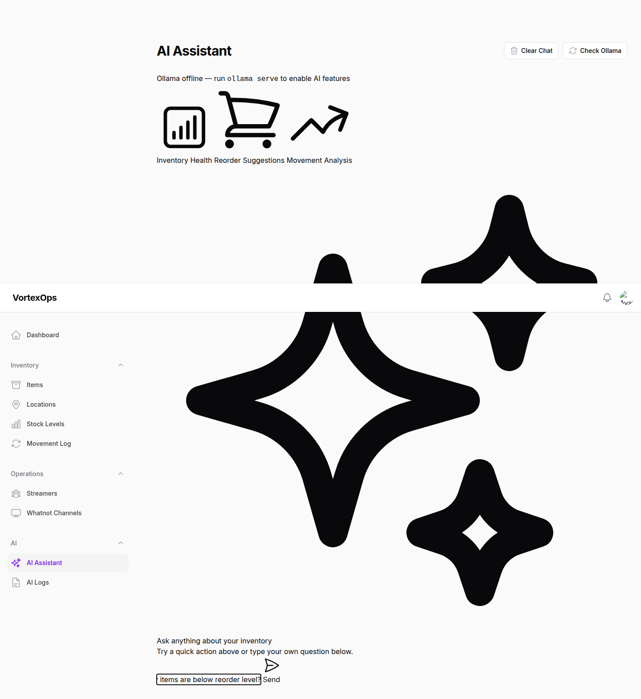
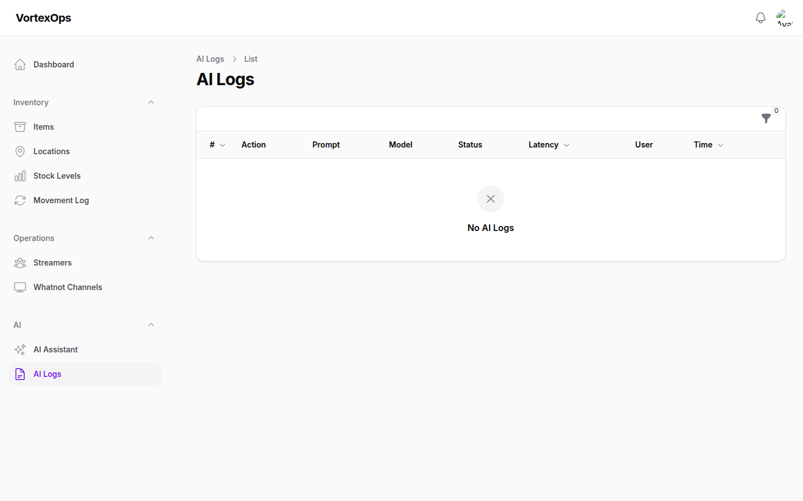

# VortexOps

Internal operations platform for **Vortex Breaks** — a Whatnot-based sports card break business.

Built with **Laravel 13** + **Filament v5**. Phase 1: Inventory Foundation.

---

## Stack

| Layer | Technology |
|---|---|
| Framework | Laravel 13 |
| Admin panel | Filament v5 |
| Database | SQLite (dev) / MySQL (prod) |
| Auth & Roles | Spatie Laravel Permission v7 |
| Audit log | Spatie Activitylog v5 |
| Queue | Laravel Queues (database driver) |
| AI | Ollama (local LLM, no external API) |

---

## Key design constraints

- **Single-tenant only** — not a SaaS platform
- **Inventory deductions never happen automatically** — every deduction requires explicit approval
- **Full audit trail** — every inventory change creates an immutable movement record
- **Whatnot channels are shared** — multiple streamers can work on the same channel

---

## Getting started

```bash
composer install
cp .env.example .env
php artisan key:generate
php artisan migrate --seed
php artisan db:seed --class=DemoDataSeeder   # optional rich demo data
php artisan serve
```

Admin login: `admin@vortexbreaks.com` / `password`

---

## Screenshots

### Login


---

### Dashboard

The dashboard shows real-time stats across the entire inventory, low-stock alerts, recent movement activity, a per-location breakdown, and active streamers.


---

### Inventory Items

#### Items list

All inventory items with category badges, total quantity across all locations, reorder-level warnings, and per-row action menus.


#### Filters panel

Filter by category, low-stock threshold, and active/inactive status.


#### Create item

Form for creating a new inventory item with SKU, name, category, unit cost, and reorder level.


#### Item detail

View a single item. The view page provides quick access to all stock operations via the header action button.


---

### Inventory Actions

Each item row has a grouped action menu with five stock operations. All operations are wrapped in database transactions and create mandatory movement log entries.

#### Action menu


#### Add Stock

Add units to any location. Logs a movement record with the selected movement type (opening balance, adjustment, return, etc.).


#### Transfer Stock

Move units between two locations. Creates paired debit/credit movement records.


#### Adjust Inventory

Set the exact quantity for a location. Computes the delta and logs a positive or negative adjustment movement.


---

### Inventory Locations

#### Locations list

All storage locations with type badges, streamer assignments, and aggregate SKU count.


#### Create location

Location type drives conditional field visibility — selecting **Streamer Inventory** reveals the streamer assignment field.


#### Streamer inventory type — conditional field

When the location type is `streamer_inventory`, the streamer selector appears automatically.


#### Location detail


---

### Stock Levels

Read-only view of every item × location combination showing current quantity, unit cost, and computed stock value. Records cannot be created or deleted here — all changes go through the inventory actions.


#### Stock levels filters

Filter by location, item, or quantity range.


---

### Movement Log

Immutable audit trail. Every stock operation — add, transfer, adjustment, sale deduction, return, damaged — creates a permanent record. Records cannot be created, edited, or deleted through the UI.


#### Movement log filters

Filter movements by type, item, or location.


---

### Streamers

#### Streamers list

All streamers with payout type badges, status (active / inactive / on leave), and tips configuration at a glance.


#### Create streamer

The payout section uses conditional fields — only the relevant rate fields appear based on the selected payout type.


#### Payout type — Profit Share

Profit share shows the payout percentage field.


#### Payout type — Package Rate

Package rate shows the per-slot package rate field.


#### Payout type — Hourly

Hourly shows the hourly rate field.


#### Streamer detail


---

### Whatnot Channels

#### Channels list

All company Whatnot channels. Channels are shared — multiple streamers can operate on the same channel.


#### Create channel


---

### Notifications

Database notifications appear in the bell icon in the Filament header (polled every 30 seconds). Two types are dispatched automatically:

- **Low Stock** (warning) — fired after any stock operation (add, transfer, adjust, return) when the item's total quantity falls at or below its reorder level.
- **Damaged Items** (danger) — fired immediately when units are moved to the damaged location via Mark Damaged.

All notifications are sent to every user in the system and stored in the `notifications` table.


---

### AI Assistant (Ollama)

The AI Assistant connects to a local [Ollama](https://ollama.com) instance and provides inventory intelligence without sending data to any external service.

#### Assistant page

Chat interface with three pre-built quick actions and a free-form question input.




**Quick actions:**
| Action | Description |
|---|---|
| Inventory Health | Summarises key concerns, urgent items, and one recommendation |
| Reorder Suggestions | Prioritises low-stock items with estimated reorder quantities |
| Movement Analysis | Identifies anomalies and high-velocity items from recent movements |

Every AI interaction is logged with the full prompt, response, context snapshot, latency, and the user who triggered it.

#### AI Logs

Read-only audit trail of every AI interaction. View the full prompt and response for any log entry.



**Setup:**

```bash
# Install and start Ollama
ollama serve
ollama pull llama3.2

# Configure in .env (defaults shown)
OLLAMA_BASE_URL=http://localhost:11434
OLLAMA_MODEL=llama3.2
OLLAMA_TIMEOUT=60
```

The assistant degrades gracefully if Ollama is offline — the status bar shows a red indicator and the send button remains functional (requests will error and log the failure).

---

## Data model

```
Streamer ──< InventoryLocation >──< InventoryStock >── InventoryItem
                    │                                       │
                    └──────────────────────────────────────┘
                                InventoryMovement
                         (from_location, to_location, qty, type)

WhatnotChannel  (standalone — shared by multiple streamers)
```

### Movement types

| Type | When created |
|---|---|
| `opening` | Initial stock entry |
| `transfer` | Stock moved between locations |
| `adjustment` | Quantity corrected |
| `sale_deduction` | Manual sale deduction (requires approval) |
| `return` | Item returned to inventory |
| `damaged` | Item marked as damaged |

---

## Project structure

```
app/
├── Filament/
│   ├── Resources/
│   │   ├── InventoryItemResource.php       # 5 stock action modals
│   │   ├── InventoryLocationResource.php
│   │   ├── InventoryMovementResource.php   # read-only audit log
│   │   ├── InventoryStockResource.php      # read-only stock view
│   │   ├── StreamerResource.php
│   │   └── WhatnotChannelResource.php
│   └── Widgets/
│       ├── StatsOverviewWidget.php
│       ├── LowStockWidget.php
│       ├── RecentMovementsWidget.php
│       ├── InventoryByLocationWidget.php
│       └── ActiveStreamersWidget.php
├── Models/
│   ├── InventoryItem.php
│   ├── InventoryLocation.php
│   ├── InventoryMovement.php
│   ├── InventoryStock.php
│   ├── Streamer.php
│   └── WhatnotChannel.php
└── Services/
    └── InventoryService.php    # all stock operations, DB transactions
```

---

## Roadmap

- **Phase 2** — Break management (break types, slots, buyers)
- **Phase 3** — Payout calculation engine
- **Phase 4** — Whatnot integration (order sync)
- **Phase 5** — Reporting & analytics
