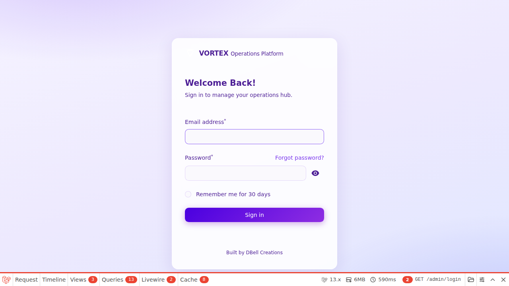
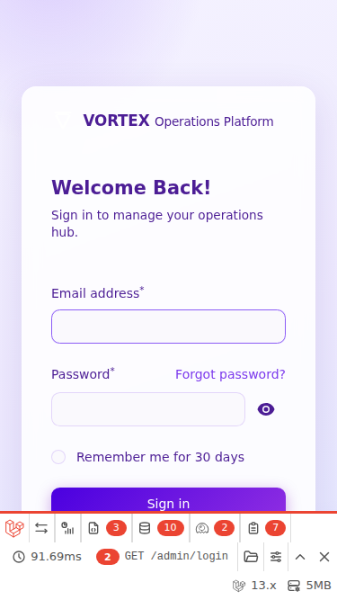
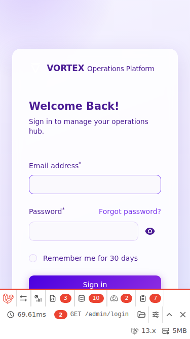

# VortexOps UI Redesign

## Overview

The VortexOps application has been redesigned to provide a modern, mobile-first user experience with responsive card-based layouts and an improved desktop interface.

## Design System

### Colors & Spacing
- **Primary Purple**: `#8b5cf6` - CTA buttons, active states
- **Sidebar Dark**: `#0f172a` to `#1a1f3a` - Dark gradient sidebar
- **Neutral Gray**: `#e2e8f0` - Borders and dividers
- **Avatar Gradients**: Rotating color scheme (purple, green, orange, red, cyan)

### Typography
- **Headlines**: 24-28px, Bold (700-800)
- **Body**: 14px, Medium (500)
- **Captions**: 12-13px, Regular (400-500)

## Desktop View

### Layout Structure
- **Dark Sidebar** (left): Fixed, collapsible navigation with grouped menu items
- **Top Bar** (full width): Search, notifications, user profile
- **Content Area** (light): Main application content with proper spacing
- **Optional Right Sidebar**: Activity feed or quick actions

### Desktop Screenshots

**Dashboard Page**


Features:
- Dark sidebar with organized navigation sections (MAIN, MANAGEMENT, TOOLS, SYSTEM)
- Light content area with stat cards showing key metrics
- Quick action cards with color-coded indicators
- Activity feed integration

**Inventory Items Page**


Features:
- Clean table layout with sticky headers
- Color-coded status badges (green, yellow, red, blue)
- Summary stat cards at the top
- Proper column spacing and alignment
- Right sidebar for additional context

## Mobile View

### Layout Strategy
- **Cards Instead of Tables**: All table data is converted to modern card layouts
- **Single Column**: Information stacked vertically for easy scrolling
- **Touch-Friendly**: Large touch targets (36-40px minimum)
- **Full-Width Actions**: Action buttons span full card width

### Mobile Screenshots

**Dashboard Page**


Features:
- Hamburger menu for sidebar navigation
- Stat cards displayed as full-width cards
- Activity items in card format
- Large, tappable buttons

**Inventory Items Page**


Features:
- Search bar with filter button
- Active filter pills easily dismissible
- Item cards with:
  - Avatar/icon (60×60px with gradient color)
  - SKU and product name
  - Stock count (bold, right-aligned)
  - Status badge (color-coded)
  - Action menu (three dots)
- Pagination controls at bottom

## Responsive Breakpoints

| Screen Size | Layout | Table Type |
|---|---|---|
| < 768px | Mobile stack | Cards |
| ≥ 768px | Sidebar + content | Traditional table |
| ≥ 1280px | Enhanced desktop | Optimized table |

## CSS Architecture

### Files
- `sidebar-topbar-integration.css` - Sidebar and topbar styling
- `mobile-responsive-tables.css` - Card layout conversion for mobile
- `desktop-table-redesign.css` - Enhanced desktop table styling
- `mobile-dashboard-cards.css` - Dashboard card layouts

### Key Features

**Mobile Cards** (@media max-width: 768px)
```css
.fi-table tbody tr {
  display: grid;
  grid-template-columns: 60px 1fr 32px;  /* avatar | content | action */
  gap: 12px;
  padding: 16px;
  background: #ffffff;
  border-radius: 12px;
  box-shadow: 0 1px 3px rgba(0, 0, 0, 0.08);
}
```

**Avatar Gradients** (Color rotation)
- Row 1n: Purple (#7c3aed → #a78bfa)
- Row 2n: Green (#10b981 → #34d399)
- Row 3n: Orange (#f59e0b → #fbbf24)
- Row 5n: Red (#ef4444 → #f87171)
- Row 7n: Cyan (#06b6d4 → #22d3ee)

**Status Badges**
- Green: Success, In Stock, Paid, Live
- Yellow/Amber: Warning, Low Stock, Pending
- Red: Error, Out of Stock, Cancelled
- Blue: Info, Shipped, Upcoming
- Purple: Processing, Admin

## Development

### Building & Deployment

```bash
# Local development
php artisan serve
npm run build

# View cache for production
php artisan view:cache

# CSS compilation
npm run build  # Tailwind + custom CSS
```

### Testing Responsive Design
- Desktop (1280×720): Test sidebar, tables, and spacing
- Tablet (768×1024): Test transition point
- Mobile (375×667): Test cards and touch targets

## Accessibility

- Minimum touch target: 36×36px
- Minimum text size: 12px
- Color contrast: WCAG AA compliant
- Dark mode support throughout
- Keyboard navigation for sidebar

## Dark Mode

All components support dark mode with inverted color schemes:
- `html.dark .fi-sidebar` - Dark sidebar colors
- `html.dark .fi-table` - Dark table backgrounds
- `html.dark .fi-badge` - Dark badge backgrounds

## Future Enhancements

- [ ] Add animation transitions between states
- [ ] Implement table virtualization for large datasets
- [ ] Add drag-and-drop for list reordering
- [ ] Enhance dark mode with theme customization
- [ ] Add accessibility annotations

---

**Last Updated**: August 12, 2026  
**Version**: 1.0.0
